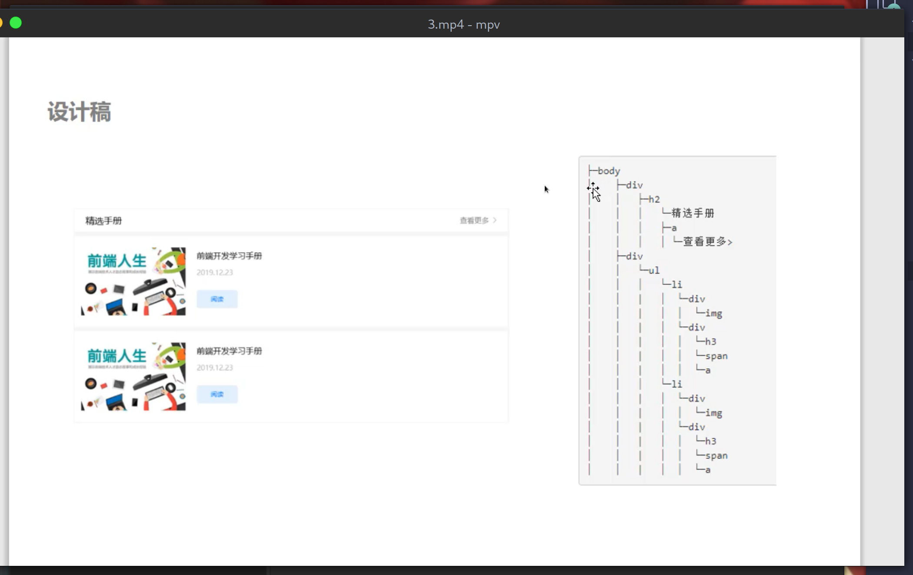

# CSS 层叠样式表
<br>

> ### .老夫聊发少年狂，左牵黄，右擎苍，锦帽貂裘，千骑卷平冈。
>                                      ——苏轼《江城子·密州出猎》
<br>
<br>

### 目录

P1： 选择器和常用属性

P2： 选择器进阶

P3： 盒子模型

P4： 浮动布局

p5:  树形结构

p6:  定位

P7： 还原设计稿

P8： html5新增标签

p9:  css新增样式

p10:  过渡效果

p11: 动画效果

p12: grid布局

p13： 响应式布局

p14: rem单位设置移动端页面尺寸

#### P1： 选择器和常用属性

常用选择器：
1. 元素选择器：标签--  h1 p span div ...
2. 类选择器: class-- .className
3. id选择器（唯一性）： id-- #idName -- 少用
4. 通配符选择器：* -- 选中所以元素

常用属性：
* 字体大小：font-size
* 字体颜色：color
* 宽度：width
* 高度：height
* 背景色：background-color
* 文本水平居中：text-align
* 文本行高（垂直居中）：line-height

```html
    <style>
        *{
            margin: 0;
            padding: 0;
        }
        p{
            /* chrome浏览器：font-size最小值12px */
            font-size: 20px;
            color: aqua;
            background-color: black;
        }
        /* 类选择器 */
        .text{
            text-align: center;
            line-height: 30px;
        }
        img{
            width: 400px;
            /* auto和不设高度都会自动适应 */
            height: auto;
        }
    </style>
</head>
<body>
    <p class="text">hello css && html</p>
    
```

例子：[p1](code/p1.html)

#### P2： 选择器进阶

选择器进阶：
1. 层级选择器：selector1 selector2 (空格--后代选择器)
2. 组合选择器：selector1,selector2 (选中两个选择器)
3. 伪类选择器(添加行为)：:hover-鼠标移入
4. 伪元素选择器：-- ：：before  ::after  content:"内容"


选择器权重：
id(100) > class(10) > element元素(1)

* 相同权重：后面会覆盖前面的。

* 层级选择器：权重叠加。 

* 权重值最高：后面+!important ;

引入css方法:

内敛样式、行内样式:  -- 权重高，代码维护困难。

嵌入样式: head内部style -- 也是少用

外部样式：引入css文件   link标签(常用)

例子：[p1](code/p2.html)

#### P3： 盒子模型

讲html元素看做盒子： 外边距、边框、内边距、内容

* 边框： border-width;border-style(solid实线,dashed虚线);border-color.

* 外边距：margin(-top-right-bottom-left-) -上-右-下-左-

* 内边距：padding(-top-right-bottom-left-) -上-右-下-左-

设置`box-sizeing:border-box`; 元素的实际高度和宽度：height和width

设置`*`margin=0;padding:0 ; 元素初始化

设置 margin= 0 auto 上下为0 左右自动居中; 元素居中显示

列表属性：
list-style: inside/点在内部 --- none/取消样式

a:设置样式： text-decoration:none

例子：[p3](code/p3.html)

#### P4： 浮动布局

分类：display

1. 块元素（block）：可以设置宽高，独占一行。h1-h6 、 p 、 div 、ul 、ol 、 li 

2. 行内元素、行级元素（inline）：不可以设置宽高，不独立成行。 a 、 span

3. 行内块（inline-block）：可以设置宽高，不独立成行。img 、 input 、button

4. 隐藏元素（none）

浮动：float

将元素同一行显示。right/left

特性：脱离文档流。 --- 解决：清除浮动

* 浮动元素后  加盒子  设置样式：clear:both;

* (最好)用伪元素元素器 给浮动元素父级设置样式，前后都清除浮动 以后也不会有影响

```html
    <style>
        .clear::before, .clear::after{
            content:"";
            /* 设置成块元素 */
            display:block;
            clear:both;
        }
        .left{
            border:1px solid red;
            float:left;
        }
    </style>


    <body>
        <div class="clear">
            <div class="left">
                123
            </div>
            <div class="left">
                abc
            </div>
        </div>
    </body>
```

完成：

例子：[p4](code/p4/p4.html)

#### p5:  树形结构

节点：
1. 根节点：有月光没有父节点，就是根节点
2. 父级节点：上级节点
3. 子级节点：下级节点
4. 同级关系：要有相同的父级节点，就是同级关系。


设计稿 -- 树结构



#### p6:  定位

定位（position）:

* 绝对定位：absolute  -- 脱离文档流 -- 默认参照浏览器左上角
* 相对定位：relative  -- 不脱离文档流 -- 相对与自己
* 固定定位：fixed     -- 脱离文档流 -- 固定的  参照浏览器视窗

坐标属性：非定位元素不起作用
top  left  right  bottom  z-index

z-index :z轴：数值大 透明度

设置参照物：父相子绝  父级也要定位

#### P7： 还原设计稿

Photoshop的基本操作:

* alt+滚轮 缩放图片
* 空格+鼠标左键 拖动图片
* shift+m 切换到选取工具，使用鼠标左键选择，ctrl+d可以取消选取。
* F8查看信息，可以查看选取内容的尺寸。
* shift+t 切换到文字工具。
* 单击色盘可以吸取颜色
* ctrl+r 切换显示标尺
* 鼠标左键可以从标尺中拖出辅助线，取消辅助线可以将其拖入标尺
* shift+c 切换到切片工具，选择切片后。
* 选择切片后，按alt+shift+ctrl+s:存储为web和设备所用格式，就可以看到切片选择的对应图片了。

完成设计稿。

#### P8： html5新增标签

html5是超文本标记语言（html）的第五次重大修改，可以简单的理解为是html的`第五个大版本`。
html5其实是包含了html5，css3的新特性，以及新增的JavaScript接口。

1. 布局元素：
* header：网页头部
* nav：导航烂
* aside：侧边栏
* article：显示文章
* section：布局的一部分
* footer：页脚

2. 媒体元素
* audio 音频
* video 视频

属性：controls- 控制面板（浏览器提供）、 autoplay--自动播放、muted -- 静音

3. 画布（canvas）

4. SVG（定义矢量图）

5. 表单新特性

#### p9:  css新增样式

css3中我们可以使用大量新增的属性，例如圆角，阴影，动画，形变等等，这让web开发便得更加简单。

1. 圆角：（border-radius）
border-radius:10px 20px;   -左上右下,右上左下
圆角的半径设置为50%，这样一个正方形的div元素就变成了一个圆形
圆角设置的四个值分别对应的是左上，右上，右下，左下。

2. 阴影：（box-shaow）
box-shaow:10px 20px 10px bule;
box-shadow属性可以设置四个值，第一个值是阴影x轴的长度，第二个值是阴影y轴的长度，第三个值是阴影的模糊半径，第四个值是阴影的颜色。

3. 形变：（transform）

* 旋转：rotate （deg单位表示度）

* 缩放：scale 按比例缩放元素

* 位移：translate 元素位移的x轴距离和y轴偏移量。

通过绝对定位，配合位移，就可以将元素放置在水平和垂直都居中的位置上了。

*  transform-origin:0,0;  旋转的原点

```html
        .box{
            width: 200px;
            height: 200px;
            border: 2px solid brown;
            box-sizing: border-box;
            /* 只水平居中 */
            /* margin: 0 auto; */
            /* 水平垂直居中 */
            position: absolute;
            left: 50%;
            top: 50%;
            transform: translate(-50%,-50%);
        }
```

#### p10:  过渡效果

过渡效果(transition):
属性:transition-property  过渡属性（例如transform）

transition-duration       过渡实际（例如1s）

transition-timing-function 过渡函数
>过渡函数:ease 开始和结束慢，中间快。默认值
>linear:匀速
>ease-in:开始慢 ease-out:结束慢
>ease-in-out:和ease类似，但幅度跟大

transition-delay        过渡延迟时间

```html 
<!-- 哈哈，乱用的 -->
        .box{
            width: 200px;
            height: 200px;
            border: 1px solid green;
            margin: 200px auto;
            box-shadow: 10px 10px 10px greenyellow;
            transition: transform 1s linear 0.5s, background-color 1s, border-radius 1s;
        }
        .box:hover{
            transform: rotate(45deg) scale(1.5) translate(10px,10px);
            background-color: hotpink;
            border-radius: 50%;
        }

```
溢出：（overflow）
属性：auto 加滚动条、hidden 超出隐藏

例子：

下拉菜单：
[p10-1](code/p10/1.html)
滚动菜单：
[p10-1](code/p10/2.html)
百度新闻首页，返回顶部菜单效果：
[p10-1](code/p10/3.html)

#### p11: 动画效果

动画效果与过渡效果的区别在于，过渡效果一般用于用户与浏览器有交互的情况下，网页出现一些动态的变化。

动画效果可以实现网页没有任何交互的情况下，自己就会展示动态效果。

@keyframes可以定义动画效果： 

```html
@keyframes anim{
    0%/from{
        transform: translate(0px,0px)
    }
    100%/to{
        transform: translate(900px,100px)
    }
}
```

animation: 调用动画（简写类似与fransition）
简写：animation-name/动画名  animation-duration:完成动画的时间  a-timing-function:速度曲线   a-delay:开始的延迟
a-iteration-count:规定播放次数(infinite-无限次数)

动画停止的属性：animation-play-state:paused


